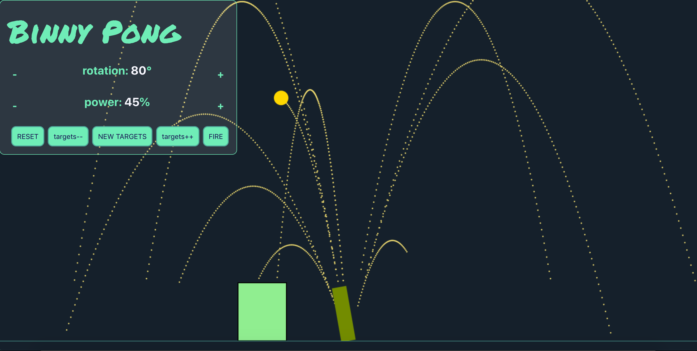

# Binny Pong

## What is Binny Pong?

Binny Pong is a React/Canvas cannon game to play over screen share on Zoom (built by Ben Lee).

[Play it here.](https://binny-pong.netlify.app)

## Your task

Use this time to explore each file of this code in your pair and document it here in this readme file. Here are a few questions and prompts to guide your exploration:

- What's the purpose of each file? How are the files organized in the repo?
- What does each component do, and how do they interact? Include a component tree diagram that outlines the relationships.
- What do each of the functions in [libs](./src/libs/) do? Where are they used?
- How does the logic of the [reducer](./src/libs/reducer.js) work? Examine each case and how the state and payload interact, and see if you can find where each action type is dispatched/used within the components.
- Are there any bits you found tricky to understand in the code? If so, why, and what helped you figure them out?
- Is there anywhere where the code looks different than what you're used to? What are some of the benefits and trade-offs of coding in different ways?
- Have a look at what's already tested and how. Are there enough tests to give you full confidence in the app? What additional tests would you write, and why? Plan out some test statements, and if you have time, write a few tests.
- What dependencies are used? Where and how are they used? (If there are any that you haven't come across yet, take a few minutes to find and scan through their docs to help.)
- Is there anything else that you haven't come across before? If so, Google and see if you can work out how it works.
- What information would a user need to be able to pick up and use this application? What information would a fellow developer need to get up to speed?
